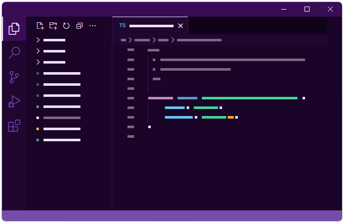

# Dark Purple+

**Dark Purple+** is a theme for VSCode based on the default Dark+ theme, but everything has been tweaked to remove the dull grey colours and replace them with warm aubergine, while accent colours are a bright purple instead of blue.
